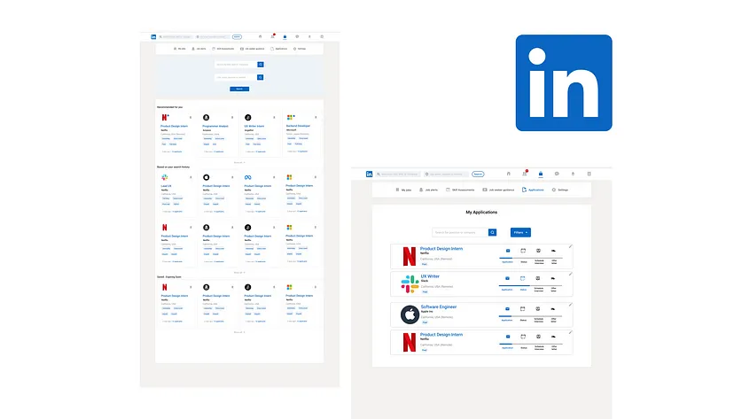
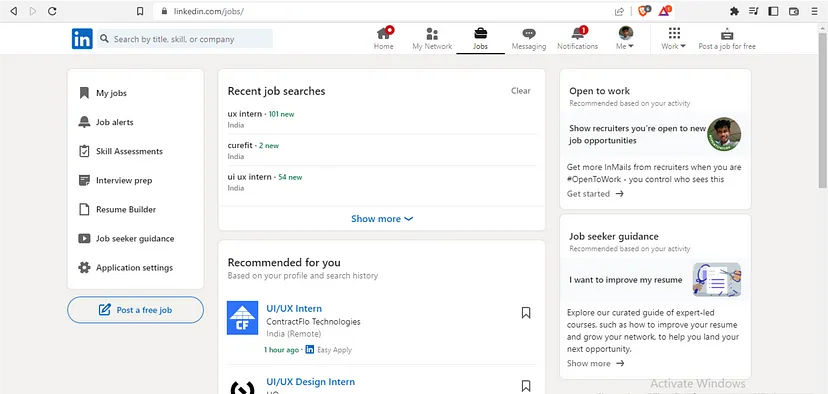
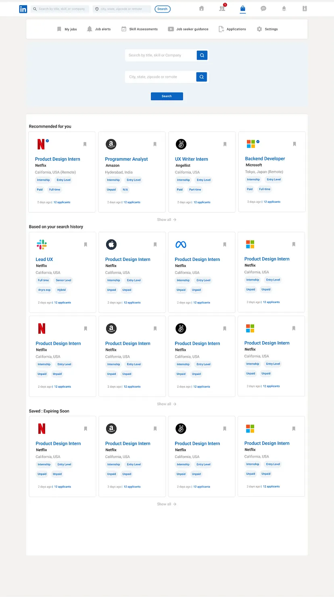
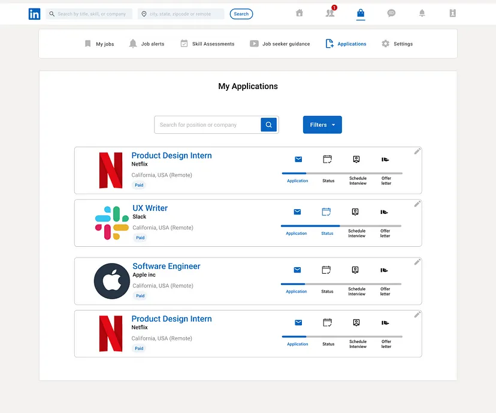

## What is LinkedIn?
Over 890 million users in 2022, **LinkedIn is a professional platform which is used to build and your professional network.** Around 49 million people use LinkedIn to search for jobs every single week.

## Why the Redesign?
I am a fresher graduate and I have no jobs right now. I applied to several jobson LinkedIn, but since I didn’t get feedback on my applications, I was kept wondering , what exactly went wrong.

A study suggests that around one-third of applicants ignore their applications, when they don’t receive a response from the recruiter/company within two weeks of submitting the application.

*So what’s the problem I’m trying to address?*

1. **Company lost a deserving Candidate**
2. **Due to lack of information/communication, the applicant lost a prospective opportunity that could have turned to be his/her new job.**

In this article, I have tried to identify few gaps in the **“Jobs Section”** of LinkedIn that needs to be bridged, and have also tried to come up with# solutions to address each one of them.

Let’s get started:

## Competitive Analysis
Before starting the project, I did competitive analysis to identify existing design patterns. I studied user flow of all kinds of similar platforms to understand the decision making factors of a user, in a better way. Some of the platforms were:

1. [AngelList](https://medium.com/@angellist)
2. [Glassdoor](https://medium.com/@Glassdoor)
3. [ZipRecruiter](https://medium.com/@ziprecruiter)
4. [Naukri](https://medium.com/@Naukri)

Although, these platforms share similarities in terms of functionality, but they still differ in the way they allow their user to experience.

## User Research
In order to gain some perspective, I created a google form, where I asked users **(who never used LinkedIn before and users who use LinkedIn frequently)** about their age, employment status and the reason for using LinkedIn.

I was dismayed to see that 60.2% of users use LinkedIn to apply for Jobs. Around 48% users were not satisfied with the process of applying jobs. So I decided to focus on improving the job transparency of the application process.

*Some of the common pain that I identified were:*

1. **Over-abundance of content**
Information placement was cluttered and **not one particular single thing was trying to catch their attention.**

## Problems
Now before moving into the problems, there were some confusions among the users with whom I interacted.

> **Confusion Number 1:** Is this applicable only for the Job seekers or the Recruiting professionals as well?

*My assumption: As of now this is only applicable on Job seekers.*

> **Confusion Number 2:** Are you referring to the entire Jobs Section or any particular niche in the Jobs section?

*My assumption: I am referring to all the flows and functions that an user undergoes while applying for a job, ranging from “searching for a job, filter options and set notification reminders.”*

### Jobs Page:

The main purpose of this page is view available jobs to the users. Being a content heavy page, the results needs to be structurally organized with the right amount of emphasis for different pieces of information.

> Problem No 1

**Lack of hierarchy** and the **scattered placement of information** in the **Jobs Page**.

This increases the **cognitive load** on the user. The user might find it difficult to scan through different sections of the screen at a glance and then find a particular result they were looking for as the user has to scan from extreme left of the screen to the extreme right. This might lead to a bad user experience for the user.

### Solution
*Centre-aligned fixed width layout*

The current design has a full width layout, Instead I made it a centre -aligned fixed-width layout, so that it’s easy to scan through sections, irrespective of the screen size.

*
Before
*

*
After
*

> Problem No 2

Users **rarely receive a feedback** on their application.

### Solution
Application Tracker

The current design has no such feature. I have added a feature that would **keep track of all the job applications** of users and also check the status of my application during the whole process.

*
Feature to track Applications
*

> Problem no 3

Candidate is often **not informed about the expiration of a job**/in-activities of the job post.

During the weekdays mostly, when the candidate is in a hurry, the candidate prefers to save the job instead of applying it straight away, as some jobs take a bit of time for their application process. In their free time when the user visits the Saved Jobs section and finds something like this!

### Solution

Notifying the candidate in advance before expiration of the job through emails and notifications.

> Problem no 4

Very little information is provided about the Company’s Culture

### Solution

There can be a **“Chat with the Recruiter”** functionality available, using which the user can reach out to the recruiter of a company that she is interested in and learn more about the culture of the company. Of course, this feature will be available only if the recruiter opts for it.

**Future Steps**

1. Contact Job Recruiters to better understand about the Job process from their point of view.
2. Improving the Application tracker further.
3. Creating a mobile application.
4. Widen the scope of the project to redesign more LinkedIn features.

## Key Learnings

1. In depth analysis of the design decisions is really important to make sure that you’re fulfilling user requirements through empathy.
2. Small change in design can impact a lot in the entire User Experience for the user.

Hit me up on [https://www.linkedin.com/in/muktiray123/](https://www.linkedin.com/in/muktiray123/) ,if you want to discuss further :)