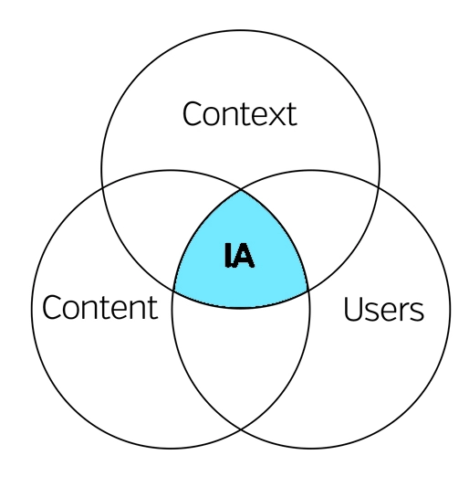

An important part of user experience (UX) design is information architecture (IA). IA is the process of deciding how to arrange the parts of something into something that is understandable and meaningful. A good starting place for this article is seeing what the non profit organisation, The [Information Architecture](https://www.iainstitute.org/) Institute, define what IA is:

> Information architecture is about helping people understand their surroundings and find what they’re looking for, in the real world as well as online.

<u>In short IA is the process of turning something from confusion into clarity
  through problem solving and organisation.</u> IA can be often overlooked in the design process as really if the designer has
done a good job with the structure and organisation it shouldn’t be obvious to the
end user, it is meant to be invisible.

IA is not only about websites and mobile apps it can be applied to daily life and in fact has been practised for thousands of years, as far back as ancient Egypt. An example of this is that in Alexandria the librarians listed contents of the library on a 120-scroll bibliography.

However IA didn’t really start to form until 1970s where XEROX Labs talked about the need for information structuring practices. Then in 1998 the book “Information Architecture for the World Wide Web” was released by authors Peter Morville and Louis Rosenfeld.

Information architecture works across all levels from your high level view of how the website should be structured and flow down to the micro level where you decide say how the search results are ordered as well as the typographically structure.

## 8 principles of good Information Architecture

As you can imagine since 1970 there has been a lot published on what information architecture is and how it should be applied in design. Dan Brown decided to create a reference list of principles which contained the most important parts of information architecture:

1. **Principle of objects:** Life is constantly moving, changing and nothing is the same twice. Everything has its own behaviours, attributes and lifecycles. A good IA architect should treat every project uniquely and begin by identifying the different types of content that’ll be shown.
2. **Principle of choices:** Users want to be able to make their own decisions, however when presented with too much choice the user can feel overwhelmed causing them to feel flustered. When designing experiences it’s important to reduce options especially if they are doing a set of tasks or are going through a flow like a checkout journey. In short, more is less.
3. **Principle of disclosure:** Show just enough information to help people understand what kinds of information they’ll find as they dig deeper. By limiting the information they see at any one time, you allow your user to better absorb what they’re seeing. If users are interested in the information, they can dive deep into it by moving from preview to detailed information.
4. **Principle of exemplars:** Show examples of content when describing the content of the categories. For example, when browsing categories on eBay, each category is represented with an image of a product that falls into that category. This makes it easy for users to identify the category.
5. **Principle of front doors:** Assume at least half of the website’s visitors will come through some page other than the homepage. That means that every page should include some basic information so they know where they are. It also means every page should include at least top-level navigation so users will know what they can do next.
6. **Principle of multiple classification:** Multiple classification means that there should be different ways for your users to browse the content on your site. Different people are likely to use different methods for finding the information on your site. For example, some users may use search function to find the content while others may want to explore through browsing.
7. **Principle of focused navigation**: Focused navigation means that navigational menus should not be defined by where they appear, but rather by what they contain.
8. **Principle of growth:** Assume the content on the website will grow. The amount of content you have on a site today may be only a small fraction of what you’ll have tomorrow, next week, or next year. Make sure the website is scalable.

> “The practice of information architecture is the effort of organizing and relating information in a way that simplifies how people navigate and use information on the Web.”\
> \
> — DSIA Research Initiative

## The 3 circles of the “information ecology”

_
Louis Rosenfeld and Peter Morville defined the ‘three circles of information architecture’ as content, users and context of use.
_

Rosenfeld and Morville visualised what makes up information architecture. They identified the 3 main components to IA are:

1. **Users:** audience, tasks, needs, information-seeking behaviour, experience
2. **Context:** business goals, politics, technology, funding, culture, resources, constraints
3. **Content:** content objectives, volume, governance and ownership, funding, culture

They referred to this as the “information ecology”.

## Cognitive Psychology

If you’ve read any of my other articles I often talk about cognitive psychology and how it can affect decision making. For those who haven’t ventured in this space, cognitive psychology looks at how the mind works as well as how it can be influenced.

Information architecture uses different parts of cognitive psychology to influence how we structure information.

As an information architect we look at the following for most value:

- **Cognitive load** is the amount of information that a person can process at any given time. Keeping in mind the user’s cognitive load helps prevent information architects from inadvertently overloading a user with too much information all at once.
- **Decision making** may not sound like psychology, but it is! It’s a cognitive process that allows us to make a choice or select an option. Information architects can help us make decisions by providing certain information at key moments.
- **Mental models** are the assumptions people carry in their minds before interacting with a website or application. Information is easier to discover when it is in a place that matches the user’s mental model of where it should be.

## Methods

### Wireframing

Wireframing is the bread and butter of any designer when they want to start to visualise how a product starts to look like. Wireframes are meant to be basic, quick and disposable and often go through many changes.

Also wireframes should be minimal, don’t worry about the colours just keep it black and white and then if you need to point out a certain area then use a colour to add prominence.

### Labeling

Labeling things can be quite subjective as everyone has their own meanings and sayings for certain words. However, the main thing is that the information is properly labelled and is clear to the end user.

### Taxonomies

Taxonomy is a way in which the information is grouped, labelled and classified. Taxonomies are a great way to find the similarities and differences between things and start to organise the information.

With what you group it could be the grouping your pages together under categories, metadata tags on an ecommerce site or sections within a website.

### Hierarchy and navigation

Hierarchy is something in the which the user understands the most critical parts on the page they are looking at compared the less important parts. It is our role to organise content to make it easier for the users to take in and consume.

To communicate hierarchy it can be done through size, colour, contrast and placement e.g. the further down on the page it is the less important it is or the smaller the button the less relevant it is.

### Content inventory and audit

A content audit is a list of all of the content on your site, most of the time in a giant spreadsheet. It can include the text, images, attachments and other media.

The purpose of the content audit is ultimately for you to decide and set the goals and scope of the audit. As an example it could be you want to see how up-to-date your content is or if the content is still relevant and in the right place.

The outcome could be you decide what pages should be removed, revised or merged together with another page. Getting that inventory of your content can be painstaking especially if you’ve got hundreds of pages but it can be a good way to get that high-level view and evaluate your content.

### Research

Research is a necessity for most projects and it is important step in being an effective Information Architect. From research we can stay to build mental models

## Summary

With our digital products we often have to communicate a lot of information like text, images, videos, forms and much more.

IA is less becoming a nice to have and more of a need to have in order for our products and services to be used and survive in an ever competitive market. By adding that structure and organisation you will bring the user experience to another level in which your users will choose you over your competitors.
