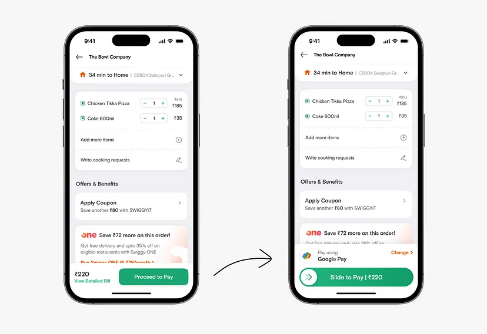
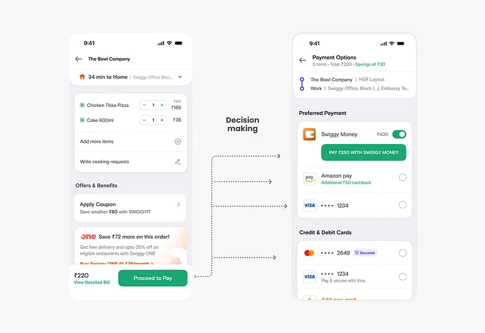
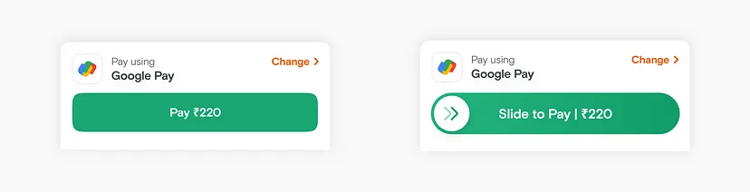
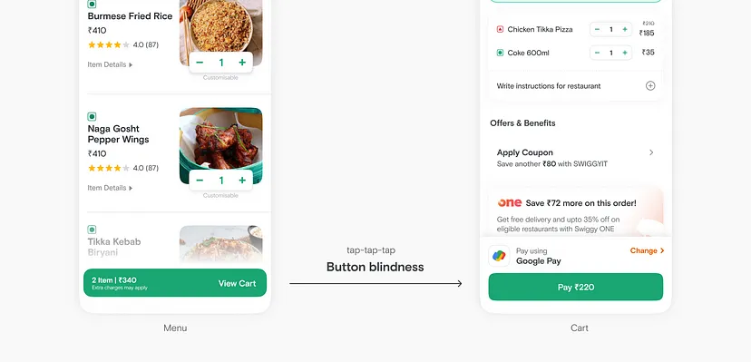
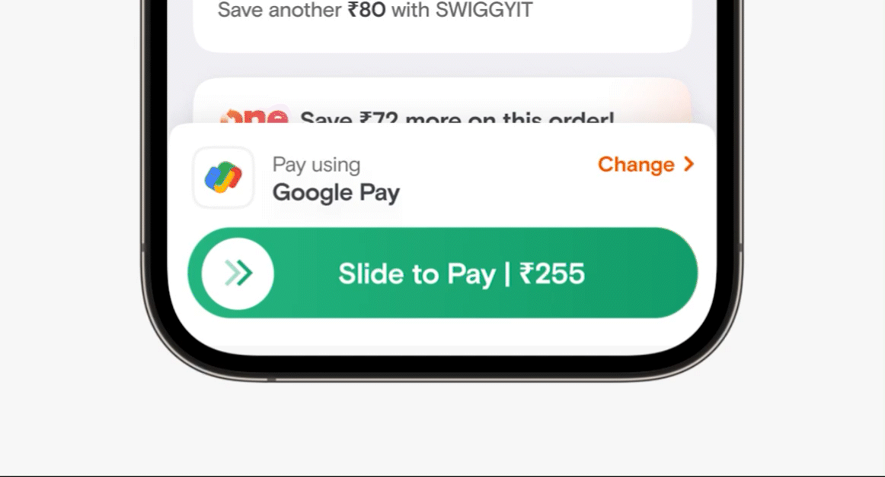
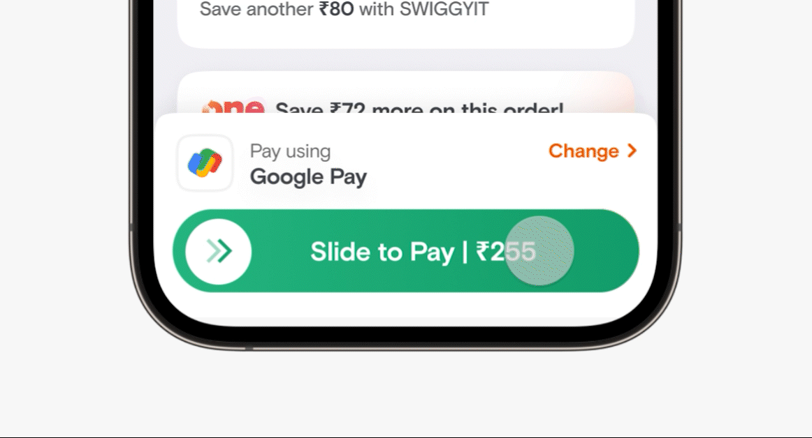
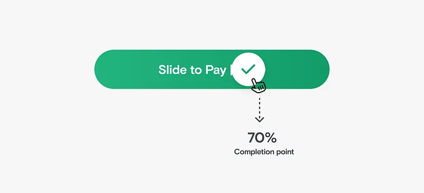
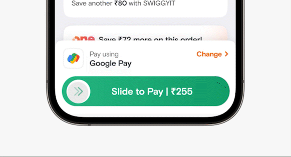
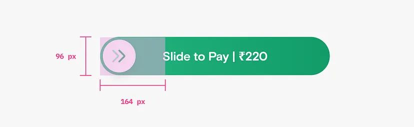

We recently made changes to our payment flow, allowing users to pay directly from their cart with their top payment methods pre-selected. And while this change might appear to be on the subtle side, don’t be fooled into thinking these are just small tweaks. We’ve been finessing this valuable bit to unlock convenience for our users and drive business growth.

But why did we invest in this when it seemed like the payment process was already solved? Well, moving from the cart page to the payment page required users to make several decisions. Although they mostly chose their preferred payment method, they were unnecessarily exposed to other options. This led to drop-offs in the user journey, as more decision-making often results in higher abandonment rates at the end of the funnel.

*
Unnecessary exposure to decisions making when 95% users paid using the top preferred payment method
*

These compelling reasons motivated us to invest in a quick checkout experience. So, we embarked on finding the perfect solution. To enable quick checkout on the cart, we needed to showcase relevant payment information, provide an option to change method, display the final amount, and, of course, include a payment button.

## Evaluating the pay button
Now, let’s talk about that payment button! We often can think of buttons as any other UI component defined in the design system. But this was no ordinary UI component; it was a super important gateway for users to become customers. To re-emphasise **this button was going to be interacted by 2–3 million users every single day.** We carefully considered the button interaction, weighing two options: a simple tap or a slide.

*
The 2 options for the payment button: tap-to-pay or slide-to-pay
*

While a tap seemed familiar and straightforward, we were concerned about accidental taps due to button blindness. On the other hand, a slide offered a more intentional interaction, **introducing a touch of ‘healthy friction' to break users’ blind tapping habit.**

*
Tap to pay had the risk of accidental taps
*

Even though the design team was more inclined towards the slider we initially went with the tap button. Since **product stakeholders had concerns around the complexity** and friction slider would introduce and also slider required higher development efforts.

Quick checkout being a big shift in the user journey, we released it in controlled experiments and followed a process of analysing experiment data and iterating.

## Data reads
Positive trend: We observed a significant increase in conversion, indicating that more users were successfully placing their orders with the new flow. It proved that there was a clear need for quick checkout.

Negative trend: However, some users were dropping off after tapping the pay button, failing to complete payment authentication

> Users were not noticing the new pay button and accidentally tapping only to realise later.

While the new UX was a success overall, we didn’t settle for half-baked solutions. We brainstormed to understand the cause of the negative trend. Our first attempt focused on making the tap button more noticeable through tooltips, shimmer animation, and copy changes. But despite our efforts, the negative trend persisted. That’s when we decided to build the slider button, getting all stakeholders on board.

## Building Slide-to-pay
Now that we got stakeholders alignment we made sure to define the slide button meticulously. We thought of every aspect of how our users would be interacting with the slider. One of the major concerns that stakeholders had was that it might lead to a drop in conversion as the fear was that users might not be able to comprehend the slide interaction. To address this, we took various measures:

## Educating with hinting
One straightforward way of educating users about a new experience is using tooltips, which we did. A secondary more smarter way is **hinting. Hinting is a way to subtly educate the users on how they are supposed to interact.** The way we thought about hinting was not from a first time experience but as a part of the core UX.

**Hint #1**: On each page load, the slider bounced to the right, accompanied by a shimmer effect, indicating the intended action that needs to be taken.

**Hint #2**: If a user tapped on the slider than meant that they wanted to complete the action and pay. So to capture this intent and guide the users the slider bounces to right indicating the interaction that is needed to complete the action.

## Tweaking the completion point
Typically, a slide interaction is considered complete when the slider reaches the end point. At Swiggy, for instance, we implemented a similar slider a few years back and learned that users didn’t slide to 100% and left the slider midway. So learning from the past we instead defined the completion area at 70%.

We also added a couple of **signifiers to indicate the state change here**; the double chevron inside the circle turns into a checkmark and a subtle haptic feedback is triggered

## Comfortable touch area
We ensured that the tap area of the slider was larger than its visible footprint, allowing users to interact comfortably.

*
Tap area of the slider
*

With these measures in place, we were ready to experiment with the slider button for our quick checkout UX.

And voila! 🎉 Upon analysis of data it was clear the slider button added healthy friction to avoid accidental taps without affecting overall user conversation. Now, quick checkout with a slide-to-pay interaction is live for all our Swiggy users.
